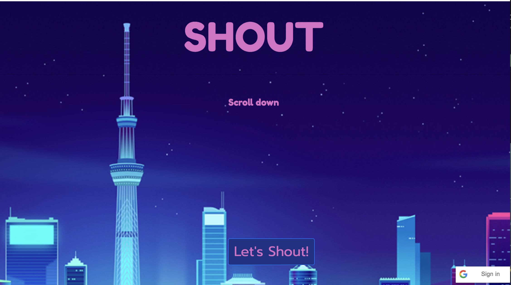
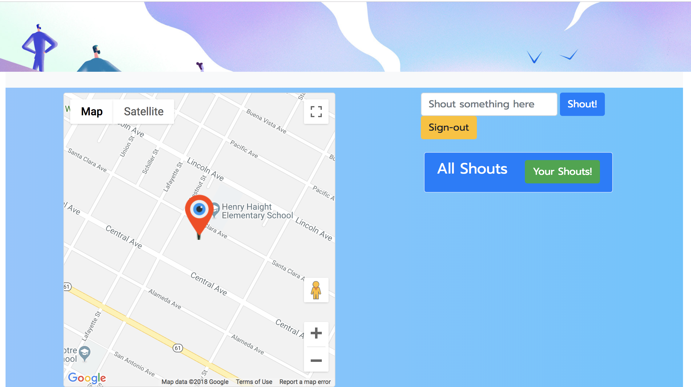

# Shout

User can use this application to notifiy(shout) events that are happening in their area. If there is accident near by or free concert a couple blocks down, then user can shout this experience to have it be seen by everyone. A app for displaying live events happening around you as you continue the day. 





# Getting Started

You can find the site here 

[Shout](https://shout-it-out.herokuapp.com/)

[Github](https://github.com/NasibNia/Shout)

### Prerequisites

You can access this site from any internet browser including: 


[Google Chrome](https://www.google.com/chrome/)

[Firefox](https://www.mozilla.org/en-US/firefox/new/)

## Deployment

The site is deployed through [Shout](https://shout-it-out.herokuapp.com/) for the public to view and includes a [Github](https://github.com/NasibNia/Shout) for the code that makes the site.

## Built With

* HTML
* CSS (Grid)
* [Bootstrap](https://getbootstrap.com/)
* JavaScript / [jQuery](https://jquery.com/)
* [Moment.js](https://momentjs.com/)
* [MySQL](https://www.mysql.com)
* [Heroku](https://www.heroku.com/)
* [JQuery](https://jquery.com)
* [NPM](https://www.npmjs.com/)
    - Sequelize
    - Express
    - Handlebars
    - Body-parser

## APIs and Libraries 

* [Google Authentication](https://developers.google.com/api-client-library/javascript/features/authentication)

    Allowed user to sign in with their Gmail account and also takes their information such as image and name to use for identifying each user for our site. 

* [Google Maps API](https://cloud.google.com/maps-platform/)

    Allowed us to generate the map and to get the current location of users.

* [UIkit](https://getuikit.com/)

    Cool CSS Library we used to organize everything and assist in the animation. 

* [UIkit](https://getuikit.com/)

    Cool CSS Library we used to organize everything and assist in the animation. 

* [Animaker](https://www.animaker.com/)

    Useful website for making animations and then we used Screencast to turn them to gifs for the opening page of the website. 

## Our Process

**Brainstorming:**
First brainstormed about the project and what ideas would be useful with the materials we learned. Originally, we thought of multiple versions including a real life area game and scavenger hunt, but both of those link back the basic Shout idea. Which includes have user report events at real time and then display them for the public to view. 

**Designing:**
For the designing process we knew that there had to be at least two - three pages. One would be the main page where we introduce Shout with a login page and then a index page that contains the content for the website. Our final product looks fairly similar to our wireframe seen below but we removed one extra page and included the login area in the main page. 


**Coding:** 
We decided that the majority of the website was going to be the backend with handlebars displaying the content. So we divided up the task with three of us working on individual minor parts and then checked each other's code before we put them in. Triple Programming with seperate folder to resolve merge issue conflicts. 

**Tasks:** 
### [Andrew](https://github.com/atton88)

Please put your tasks here 


### [Nasi](https://github.com/NasibNia)

Please put your tasks here 


### [Muhammad](https://github.com/mawais54013)

I worked on the Google Maps API by displaying the map to the page and getting the user's Geolocation to use and display the content. Google API allows use to get the real time location of the user while also displaying information which in this case a Shout as the content of a marker. 

```
<div class="card" style="width: 18rem; display:none">
    <div class="card-body">
        <h5 class="card-title">All Shouts</h5>
        <div id="userPut">
            {{#each allShouts}}
            <div class="alert alert-primary" role="alert">
                <div>|</div>
                {{this.body}}
            </div>
            {{/each}}
        </div>
    </div>
</div>
```
The code above is used to grab the content from the user input and store it in to a marker. The issue happened that I could not grab the content from the main All Shouts area because then I was getting every single information that I did not need. So this div is useful to seperate the content from the other information and then use a split to organize it and lastly add it to the marker. 

```
navigator.geolocation.getCurrentPosition(function (position) {
    pos = {
        lat: position.coords.latitude,
        lng: position.coords.longitude
    };
        
    var icon = {
        url: '../assets/images/marker2.png',
        scaledSize: new google.maps.Size(80, 80),
    };

    marker = new google.maps.Marker({
        map: map,
        icon: icon,
        position: { lat: pos.lat, lng: pos.lng },
    });

    google.maps.event.addListener(marker, 'click', (function (marker, i) {
        return function () {
            infowindow.setContent(b[b.length - 1]);
            infowindow.open(map, marker);
        }
    })(marker, i));
    setTimeout(function () {
        marker.setMap(null);
        delete marker;

    }, 3600000);
    return marker;
});   
```
The code above shows that from navigator, the user current location is selected with the lat and lng. The a marker is created that will be displayed on map with a icon on that position. Additionally, I included a listener to the marker so that when the marker is clicked then a function will be run that displays the content taken from the user input. Lastly, every marker includes a timeout period which in this case is 1 hour. The marker will appear on the map for that period and then disappear until the user can make another shout. 

## Authors
* **Andrew** - https://github.com/atton88
* **Nasi** - https://github.com/NasibNia
* **Muhammad** - https://github.com/mawais54013

## Acknowledgments

* UCB Extension Coding Bootcamp 